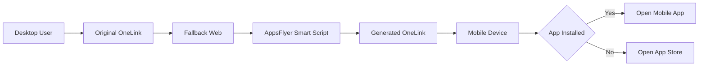

# การทำงานระหว่าง AppsFlyer OneLink กับ Fallback Web

## สารบัญ

- [การทำงานระหว่าง AppsFlyer OneLink กับ Fallback Web](#การทำงานระหว่าง-appsflyer-onelink-กับ-fallback-web)
  - [สารบัญ](#สารบัญ)
  - [Overview](#overview)
  - [ภาพรวม Flow การทำงาน](#ภาพรวม-flow-การทำงาน)
  - [บทบาทของแต่ละส่วน](#บทบาทของแต่ละส่วน)
    - [AppsFlyer OneLink](#appsflyer-onelink)
    - [Fallback Web](#fallback-web)
    - [AppsFlyer Smart Script](#appsflyer-smart-script)
    - [Mobile App](#mobile-app)
  - [ข้อมูลที่ส่งผ่านระหว่างระบบ](#ข้อมูลที่ส่งผ่านระหว่างระบบ)
  - [การตั้งค่า OneLink และ Fallback Web](#การตั้งค่า-onelink-และ-fallback-web)
  - [การทำงานของ Smart Script บน Fallback Web](#การทำงานของ-smart-script-บน-fallback-web)
  - [แนวทางการทดสอบ](#แนวทางการทดสอบ)
    - [1. ทดสอบ Fallback Web โดยตรง](#1-ทดสอบ-fallback-web-โดยตรง)
    - [2. ทดสอบ OneLink บน Desktop](#2-ทดสอบ-onelink-บน-desktop)
    - [3. ทดสอบ Generated Link บน Mobile](#3-ทดสอบ-generated-link-บน-mobile)
    - [4. ทดสอบกรณียังไม่ได้ติดตั้งแอป](#4-ทดสอบกรณียังไม่ได้ติดตั้งแอป)
    - [5. ทดสอบ Default Values](#5-ทดสอบ-default-values)
  - [ข้อควรระวัง](#ข้อควรระวัง)
  - [สรุป](#สรุป)

## Overview

เอกสารนี้อธิบายแนวทางการใช้งาน AppsFlyer OneLink ร่วมกับ Fallback Web เพื่อรองรับกรณีที่ผู้ใช้เปิด OneLink บน desktop หรือ environment ที่ไม่สามารถเปิด mobile app ได้โดยตรง

แนวคิดหลักคือ เมื่อผู้ใช้เปิด OneLink บน desktop ระบบจะ redirect ไปยังหน้า Fallback Web จากนั้นหน้าเว็บจะใช้ AppsFlyer Smart Script เพื่อสร้าง OneLink อีกชุดหนึ่งที่มี attribution และ custom attributes ที่ต้องการ แล้วแสดงให้ผู้ใช้ใช้งานต่อผ่าน link หรือ QR code

แนวทางนี้ช่วยให้ทีมสามารถทดสอบและควบคุม flow จาก web ไป mobile app ได้ดีขึ้น โดยเฉพาะกรณีที่ต้องส่ง custom attributes ไปยังแอป เช่น source, agent, branch หรือข้อมูล campaign อื่นๆ

## ภาพรวม Flow การทำงาน



ลำดับการทำงานโดยสรุป:

1. ผู้ใช้เปิด OneLink จาก desktop
2. AppsFlyer ตรวจพบว่าเป็น desktop และ redirect ไปยัง Fallback Web
3. Fallback Web โหลด AppsFlyer Smart Script
4. Smart Script อ่าน query parameters ที่มากับหน้าเว็บ
5. Smart Script สร้าง generated OneLink ที่มี attribution/custom attributes
6. หน้าเว็บแสดง generated link และ QR code
7. ผู้ใช้ copy link หรือ scan QR ด้วย mobile device
8. generated OneLink เปิด mobile app หรือส่งผู้ใช้ไปยัง app store ตามสถานะการติดตั้งแอป

## บทบาทของแต่ละส่วน

### AppsFlyer OneLink

OneLink เป็น entry point หลักของ campaign หรือ flow ที่ต้องการให้ผู้ใช้เปิด mobile app โดยสามารถกำหนด behavior ได้ตาม platform เช่น iOS, Android, desktop หรือ web

ใน flow นี้ OneLink ทำหน้าที่:

- รับ click แรกจากผู้ใช้
- ตรวจ platform/device
- เปิด mobile app โดยตรงเมื่อเป็น mobile และรองรับ deep link
- redirect ไป Fallback Web เมื่อเป็น desktop
- ส่งต่อ attribution parameters หรือ custom parameters ตาม configuration

### Fallback Web

Fallback Web เป็นหน้าเว็บที่ถูกเปิดเมื่อ OneLink ไม่สามารถเปิด mobile app ได้โดยตรง เช่นกรณี desktop user

Fallback Web ทำหน้าที่:

- รับ query parameters จาก OneLink
- โหลด AppsFlyer Smart Script
- สร้าง generated OneLink สำหรับให้ผู้ใช้เปิดต่อบน mobile
- แสดง generated link
- ให้ผู้ใช้ copy link ได้
- แสดง QR code เพื่อ scan บน mobile
- แสดง debug information เฉพาะช่วงทดสอบ

### AppsFlyer Smart Script

Smart Script เป็น script ของ AppsFlyer ที่ทำงานบนหน้าเว็บ เพื่อสร้าง outgoing OneLink จากข้อมูลที่หน้าเว็บได้รับ

Smart Script ทำหน้าที่:

- อ่าน incoming URL parameters
- map parameters ไปยัง AppsFlyer attribution fields
- map custom parameters ไปยัง custom attributes ที่แอปต้องใช้
- สร้าง generated OneLink
- สร้าง QR code จาก generated OneLink ได้

### Mobile App

Mobile app เป็นปลายทางของ generated OneLink

Mobile app ทำหน้าที่:

- เปิดแอปเมื่อผู้ใช้กด generated OneLink หรือ scan QR
- อ่าน deep link parameters/custom attributes จาก AppsFlyer SDK หรือ deep link handler
- ใช้ custom attributes เพื่อกำหนด behavior ภายในแอป เช่น routing, tracking, หรือ prefill information

## ข้อมูลที่ส่งผ่านระหว่างระบบ

ข้อมูลที่ส่งผ่านควรถูกออกแบบให้ชัดเจนว่า field ไหนใช้เพื่อ attribution และ field ไหนใช้เพื่อ business logic ภายในแอป

ตัวอย่างกลุ่มข้อมูล:

- Attribution parameters เช่น media source, campaign, channel, adset
- Custom attributes เช่น `<custom-attribute-1>`, `<custom-attribute-2>`, `<custom-attribute-3>`
- Technical parameters เช่น parameter ที่บอกว่า link ถูกสร้างจาก Smart Script หรือ fallback page

ตัวอย่าง URL สำหรับทดสอบหน้า fallback โดยตรง:

```text
https://<fallback-domain>/<fallback-path>?<custom-attribute-1>=<value-1>&<custom-attribute-2>=<value-2>&<custom-attribute-3>=<value-3>
```

ตัวอย่าง OneLink ที่ส่ง fallback URL ผ่าน parameter:

```text
https://<onelink-domain>/<template-id>/<link-id>?af_web_dp=<encoded-fallback-url>
```

หากต้องการส่ง custom attributes ไปพร้อม fallback URL ต้อง encode query string ให้ถูกต้อง:

```text
https://<onelink-domain>/<template-id>/<link-id>?af_web_dp=https%3A%2F%2F<fallback-domain>%2F<fallback-path>%3F<custom-attribute-1>%3D<value-1>%26<custom-attribute-2>%3D<value-2>%26<custom-attribute-3>%3D<value-3>
```

## การตั้งค่า OneLink และ Fallback Web

การตั้งค่าหลักที่ต้องเตรียมมีดังนี้:

1. สร้างหรือเลือก OneLink template ที่ใช้สำหรับ flow นี้
2. กำหนด desktop fallback หรือ web fallback ให้ชี้ไปยัง Fallback Web
3. ตรวจสอบว่า fallback domain ถูกเพิ่มใน redirect allowlist ของ AppsFlyer แล้ว
4. ตรวจสอบว่า OneLink ไม่ได้ปิดการ forward parameters ที่จำเป็น
5. เตรียม Fallback Web ให้รองรับ query parameters ที่ต้องใช้
6. ตรวจสอบว่า generated OneLink มี parameters ครบตามที่ mobile app ต้องการ

ค่า fallback URL ที่ควรตั้งใน AppsFlyer ควรอยู่ในรูปแบบ:

```text
https://<fallback-domain>/<fallback-path>
```

หากระบบ AppsFlyer หรือ policy ภายในองค์กรต้องใช้ redirect allowlist ควรแจ้งทั้ง domain และ full path:

```text
https://<fallback-domain>
https://<fallback-domain>/<fallback-path>
```

## การทำงานของ Smart Script บน Fallback Web

บน Fallback Web จะมีการโหลด Smart Script แล้วเรียก function เพื่อ generate OneLink

แนวคิดของ configuration:

```javascript
const oneLinkURL = "https://<onelink-domain>/<template-id>";

const afParameters = {
  mediaSource: {
    defaultValue: "<default-media-source>",
  },
  afCustom: [
    {
      paramKey: "<custom-attribute-1>",
      keys: ["<custom-attribute-1>"],
      defaultValue: "<default-value-1>",
    },
    {
      paramKey: "<custom-attribute-2>",
      keys: ["<custom-attribute-2>"],
      defaultValue: "<default-value-2>",
    },
    {
      paramKey: "<custom-attribute-3>",
      keys: ["<custom-attribute-3>"],
      defaultValue: "<default-value-3>",
    },
  ],
};

const result = window.AF_SMART_SCRIPT.generateOneLinkURL({
  oneLinkURL,
  afParameters,
});
```

เมื่อ Smart Script generate สำเร็จ จะได้ค่า `result.clickURL` ซึ่งนำไปใช้ได้กับ:

- generated link ที่แสดงบนหน้า
- ปุ่ม copy link
- QR code
- debug panel สำหรับตรวจสอบระหว่างทดสอบ

ข้อควรระวังในการทำ QR code:

- หากใช้ React หรือ framework ที่จัดการ DOM เอง ควรให้ QR container เป็น empty element
- ไม่ควรให้ React render child node ภายใน element เดียวกับที่ Smart Script จะเข้าไปแก้ DOM
- หากต้องการแสดง placeholder ให้ใช้ element แยก หรือ CSS pseudo-element เพื่อเลี่ยง DOM ownership conflict

## แนวทางการทดสอบ

### 1. ทดสอบ Fallback Web โดยตรง

เปิด Fallback Web พร้อม custom attributes:

```text
https://<fallback-domain>/<fallback-path>?<custom-attribute-1>=<value-1>&<custom-attribute-2>=<value-2>&<custom-attribute-3>=<value-3>
```

ตรวจสอบ:

- หน้าเว็บโหลดได้
- debug panel เห็น incoming query parameters
- generated link ถูกสร้าง
- generated link มี custom attributes ครบ
- QR code แสดงได้
- copy link ได้

### 2. ทดสอบ OneLink บน Desktop

เปิด OneLink บน desktop:

```text
https://<onelink-domain>/<template-id>/<link-id>
```

ตรวจสอบ:

- OneLink redirect มาที่ Fallback Web
- Fallback Web ได้รับ parameters ที่ต้องการ
- generated link ถูกสร้างจาก Smart Script
- QR code แสดงได้

### 3. ทดสอบ Generated Link บน Mobile

เปิด generated link บน mobile device ที่ติดตั้งแอปแล้ว

ตรวจสอบ:

- แอปถูกเปิด
- custom attributes ถูกส่งถึงแอป
- แอปอ่านค่าจาก deep link หรือ AppsFlyer callback ได้ถูกต้อง

### 4. ทดสอบกรณียังไม่ได้ติดตั้งแอป

เปิด generated link บน mobile device ที่ยังไม่ได้ติดตั้งแอป

ตรวจสอบ:

- ผู้ใช้ถูกส่งไป app store หรือ fallback ที่กำหนด
- attribution/deferred deep link ทำงานตาม expected behavior หลังติดตั้งแอป

### 5. ทดสอบ Default Values

เปิด Fallback Web โดยไม่ส่ง custom attributes

ตรวจสอบ:

- generated link ยังถูกสร้างได้
- custom attributes ใช้ default values ตามที่กำหนด
- หน้าเว็บไม่เกิด error

## ข้อควรระวัง

- Fallback domain ต้องถูกเพิ่มใน AppsFlyer redirect allowlist ก่อนจึงจะใช้ redirect จาก OneLink ได้
- หาก OneLink ไม่ forward query parameters ไปยัง fallback page อาจต้องฝัง custom attributes ไว้ใน fallback URL ผ่าน `af_web_dp`
- ควร URL encode ค่า fallback URL และ query parameters ให้ถูกต้อง
- ไม่ควรใส่ sensitive data หรือ PII ใน query parameters
- Debug panel ควรใช้เฉพาะช่วงทดสอบ และควรซ่อนหรือปิดก่อน production
- ต้อง verify กับ mobile app ว่า key ของ custom attributes ตรงกับ logic ที่แอปอ่านจริง
- ต้องยืนยันว่า Smart Script ใช้ OneLink template URL หรือ short OneLink URL ตามรูปแบบที่ AppsFlyer dashboard กำหนด
- หากใช้ framework เช่น React ต้องระวังการให้ third-party script แก้ DOM ใน element ที่ framework จัดการอยู่

## สรุป

แนวทางนี้ช่วยให้ OneLink รองรับ desktop user ได้ดีขึ้น โดยให้ desktop user ไปยัง Fallback Web แทนการพยายามเปิด mobile app โดยตรง

Fallback Web จะทำหน้าที่เป็นตัวกลางในการสร้าง generated OneLink ผ่าน AppsFlyer Smart Script พร้อมแนบ attribution และ custom attributes ที่จำเป็น จากนั้นผู้ใช้สามารถ copy link หรือ scan QR code เพื่อเปิดต่อบน mobile

สิ่งที่ต้องตรวจให้ครบก่อนใช้งานจริงคือ redirect allowlist, parameter forwarding, generated OneLink, QR code, และการรับ custom attributes ฝั่ง mobile app
